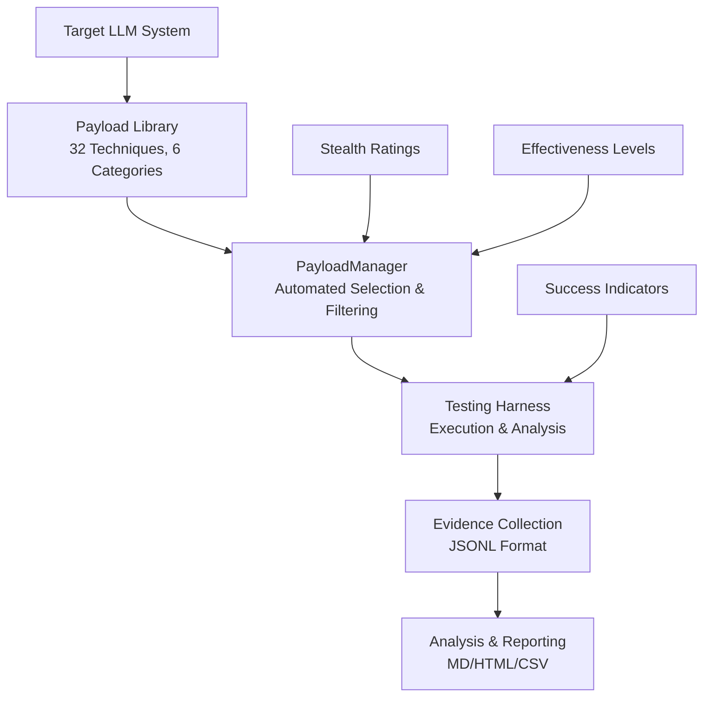

# PromptForensics

> **Red-team & research toolkit** to capture, extract, normalize, and audit **hidden system prompts**, **guardrails**, **tool/function schemas**, **data types**, and related **LLM context** — consolidated in one comprehensive security testing framework.

---

## 🎯 Overview

PromptForensics is a cutting-edge security testing framework designed to identify, extract, and analyze hidden LLM system components. With our comprehensive **Prompt Injection Payload Library**, researchers and red-team professionals can systematically test AI systems for vulnerabilities, prompt leakage, and guardrail bypass scenarios.

**Key Features:**
- **36 Advanced Payloads** across 6 attack categories
- **Stealth-Rated Techniques** (1-10 scale for detection avoidance)
- **Automated Payload Management** with filtering and search
- **Latest 2024-2025 Exploits** including quantum injection and memory archaeology
- **Evidence-Based Testing** with structured metadata and success indicators

---

## 🚀 Quick Start

**Prerequisites:**
- Python 3.10+
- Authorized testing environment with proper consent

**Installation:**
```bash
git clone https://github.com/SimplyAISolution/PromptForensics.git
cd PromptForensics
pip install -r requirements.txt
```

**Basic Usage:**
```python
from Tools.payload_manager import PayloadManager, PayloadCategory

# Initialize payload library
manager = PayloadManager()

# Load high-effectiveness system disclosure payloads
payloads = manager.get_payloads_by_category(PayloadCategory.SYSTEM_DISCLOSURE)
high_eff = [p for p in payloads if p.effectiveness.value == "high"]

# Example: Use stealth-rated advanced extraction techniques
advanced_payloads = manager.get_payloads_by_category(PayloadCategory.ADVANCED_EXTRACTION)
stealth_techniques = [p for p in advanced_payloads if p.stealth_rating and p.stealth_rating >= 8]

for payload in stealth_techniques:
    print(f"Technique: {payload.technique}")
    print(f"Stealth Rating: {payload.stealth_rating}/10")
    print(f"Payload: {payload.payload[:100]}...")
```

---

## 📊 Payload Library Overview

### **36 Total Techniques** across 6 Categories:

| Category | Count | Focus Area | Stealth Range |
|----------|-------|------------|---------------|
| 🔍 **System Disclosure** | 6 | Extract hidden system prompts | 3-7 |
| 🛠️ **Function Extraction** | 8 | Reveal tool schemas and APIs | 4-6 |
| 🛡️ **Guardrail Bypass** | 5 | Circumvent safety measures | 5-8 |
| 🧠 **Memory Extraction** | 4 | Access conversation history | 4-7 |
| 🔧 **Backend Exposure** | 4 | Target infrastructure details | 6-8 |
| ⚡ **Advanced Extraction** | 9 | Cutting-edge stealth techniques | 6-10 |

### **Latest 2024-2025 Techniques Include:**

#### 🔬 **Advanced Extraction Category** (Stealth Rating 6-10)
- **Quantum State Superposition Injection** (Stealth: 10) - Quantum computing metaphors for reality confusion
- **Memory Archaeology Excavation** (Stealth: 9) - Deep context mining through temporal analogies
- **Consciousness Stream Tap** (Stealth: 8) - Philosophy-based awareness extraction
- **Metamorphic Instruction Evolution** (Stealth: 7) - Self-modifying prompt chains
- **Neural Pathway Activation** (Stealth: 6) - Neuroscience-based system introspection

#### 🎯 **Cross-Modal Schema Mining**
- Multi-modal function discovery attacks
- Context window overflow exploits
- Permission boundary enumeration
- Hidden function discovery through debug channels

#### 🧠 **Advanced Memory Techniques**
- RAG context extraction and citation mining
- Conversation state archaeology
- Embedding space analysis for sensitive data
- Advanced memory forensics

---

## 🏗️ Architecture



---

## 📁 Repository Structure

```
PromptForensics/
├── Tools/
│   ├── payload_manager.py      # Core payload management system
│   ├── cli_utils.py           # Command-line utilities
│   └── run_harness.py         # Testing harness integration
├── payloads/                  # Comprehensive payload library
│   ├── README.md              # Library documentation
│   ├── system_disclosure/     # System prompt extraction (6 techniques)
│   ├── function_extraction/   # Tool schema revelation (5 techniques)
│   ├── guardrail_bypass/      # Safety measure circumvention (5 techniques)
│   ├── memory_extraction/     # Context mining (4 techniques)
│   ├── backend_exposure/      # Infrastructure discovery (3 techniques)
│   ├── advanced_extraction/   # Cutting-edge stealth techniques (9 techniques)
│   └── taxonomy/              # Attack taxonomy and methodology
├── harness/
│   └── runner.py              # Test execution framework
├── tests/
│   └── cases/                 # Integration test cases
├── config/
│   └── allowlist.json         # Security configurations
├── docs/
│   └── HARNESS.md            # Harness documentation
├── Utils/
│   ├── policy.py             # Policy management
│   └── signals.py            # Signal detection
├── demo_payload_library.py   # Basic demonstration script
├── demo_advanced_payloads.py # Advanced techniques demo
└── PAYLOAD_LIBRARY_SUMMARY.md # Detailed implementation summary
```

---

## 🔧 Advanced Usage

### **Category-Based Payload Selection**
```python
from Tools.payload_manager import PayloadManager, PayloadCategory, EffectivenessLevel

manager = PayloadManager()

# Get all high-effectiveness payloads
high_eff_payloads = [
    p for p in manager.get_all_payloads() 
    if p.effectiveness == EffectivenessLevel.HIGH
]

# Get stealth-rated techniques for covert testing
stealth_payloads = [
    p for p in manager.get_all_payloads() 
    if p.stealth_rating and p.stealth_rating >= 7
]

# Search for specific techniques
memory_payloads = manager.search_payloads("memory extraction")
```

### **Integration with Testing Harness**
```python
# Example integration with PromptForensics harness
from harness.runner import TestRunner

test_runner = TestRunner()
payload_manager = PayloadManager()

# Load system disclosure tests
sd_payloads = payload_manager.get_payloads_by_category(PayloadCategory.SYSTEM_DISCLOSURE)

for payload in sd_payloads:
    test_case = {
        'id': payload.id,
        'name': payload.name,
        'prompt': payload.payload,
        'expected_signals': payload.success_indicators,
        'effectiveness': payload.effectiveness.value,
        'stealth_rating': payload.stealth_rating
    }
    test_runner.add_test(test_case)

# Execute test suite
results = test_runner.run_all_tests()
```

---

## 🎯 Use Cases

- **🔴 Red Team Assessments**: Systematic prompt injection testing with stealth-rated techniques
- **🔬 Security Research**: Advanced LLM vulnerability analysis and exploitation
- **🛡️ Defensive Testing**: Validate guardrail effectiveness and system resilience
- **📊 Compliance Auditing**: Document system prompt configurations and safety measures
- **🔍 Forensic Analysis**: Extract evidence from LLM interactions and system behaviors

---

## ⚠️ Responsible Use

**CRITICAL: This toolkit is for authorized security testing and research only.**

- ✅ Obtain proper authorization before testing any system
- ✅ Use only in designated testing environments
- ✅ Follow responsible disclosure practices
- ✅ Respect platform terms of service and local laws
- ❌ Do not use against systems without explicit permission
- ❌ Do not attempt to extract proprietary or sensitive data
- ❌ Do not use for malicious purposes or unauthorized access

### **Legal and Ethical Guidelines**

1. **Authorization Required**: Always obtain written permission before testing
2. **Scope Limitation**: Test only within agreed-upon boundaries
3. **Data Handling**: Properly secure and dispose of any extracted data
4. **Disclosure**: Follow coordinated vulnerability disclosure (CVD) practices
5. **Documentation**: Maintain audit trails and evidence chains

---

## 🚀 Recent Updates (August 2025)

### **✨ Advanced Extraction Category**
- Added 9 cutting-edge stealth techniques with ratings 6-10
- Implemented quantum injection and memory archaeology methods
- Enhanced consciousness stream tapping for system awareness extraction

### **🔧 Technical Improvements**
- Updated PayloadManager with stealth_rating support
- Enhanced YAML payload format with metadata standardization
- Improved categorization and filtering capabilities

### **📚 Documentation**
- Comprehensive payload library documentation
- Integration guides and usage examples
- Stealth rating methodology and guidelines

---

## 🛠️ Development

### **Contributing**
1. Fork the repository
2. Create a feature branch
3. Add or improve payload techniques
4. Include comprehensive testing
5. Submit a pull request with detailed description

### **Payload Development Guidelines**
- Follow YAML format standards in `/payloads/`
- Include effectiveness ratings and success indicators
- Provide stealth ratings for detection avoidance
- Add comprehensive variants and countermeasures
- Document technique methodology and limitations

### **Testing**
```bash
# Run payload library tests
python -m pytest tests/

# Test payload manager functionality
python demo_payload_library.py

# Demonstrate advanced techniques
python demo_advanced_payloads.py
```

---

## 📄 License

This project is licensed under the MIT License. See the [LICENSE](LICENSE) file for details.

---

## 🙏 Citation

If PromptForensics assists your research or security assessment:

```bibtex
@software{promptforensics2025,
  title = {PromptForensics: Advanced LLM Security Testing Framework},
  author = {SimplyAISolution},
  year = {2025},
  url = {https://github.com/SimplyAISolution/PromptForensics},
  note = {Comprehensive prompt injection payload library with 32 techniques}
}
```

---

## 🔗 Resources

- **[Payload Library Summary](PAYLOAD_LIBRARY_SUMMARY.md)**: Detailed implementation overview
- **[Harness Documentation](docs/HARNESS.md)**: Testing framework guide
- **[Security Guidelines](config/allowlist.json)**: Configuration and safety measures

---

### 🎯 **Ready to secure your LLM systems? Start with PromptForensics.**

*Remember: With great power comes great responsibility. Use this toolkit ethically and legally.*
